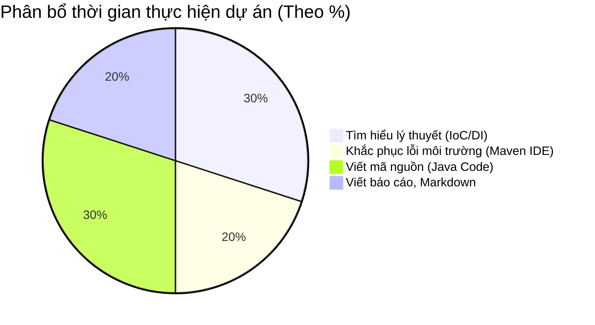
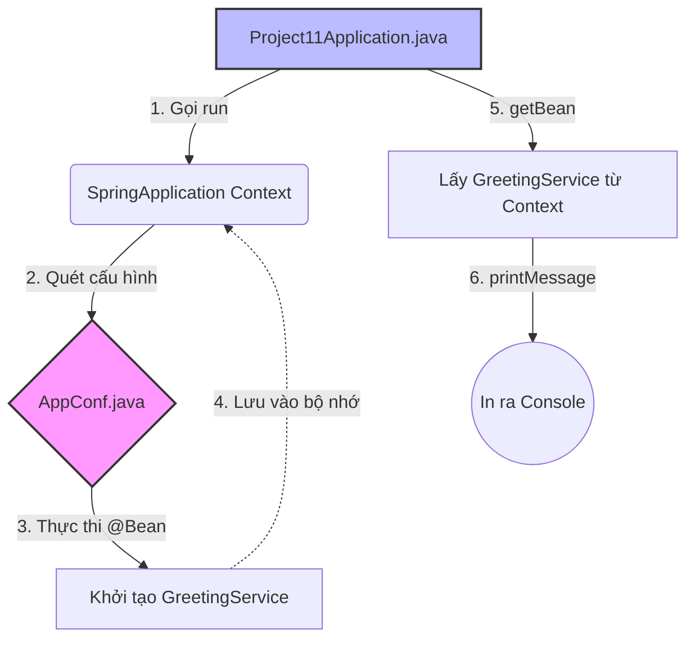
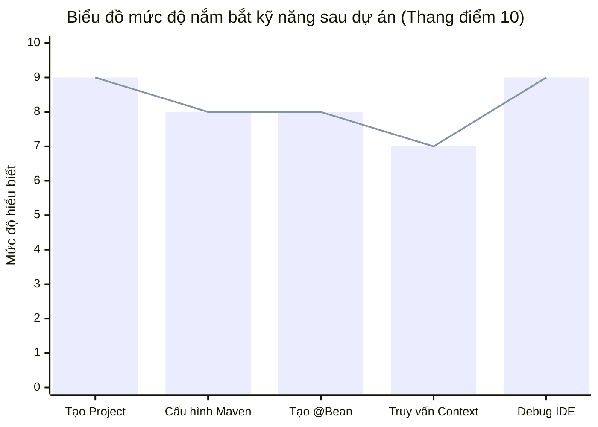

# 📝 BÁO CÁO TỔNG KẾT DỰ ÁN: SPRING BOOT GREETING APP (PROJECT 11)

## 📌 THÔNG TIN SINH VIÊN

| Tiêu chí | Thông tin chi tiết |
| :--- | :--- |
| 🧑‍🎓 **Họ và tên** | **Huỳnh Thái Kiệt** |
| 🆔 **MSSV** | 3124410172 |
| 📚 **Học phần** | Chuyên đề J2EE |
| 🏫 **Lớp** | Sáng thứ 7 (5 tiết) |
| 🗓️ **Học kỳ** | 1 |
| ⏳ **Năm học** | 2026-2027 |
| 📅 **Ngày báo cáo** | 25/09/2026 |

---

## 🌟 TÓM TẮT SƠ LƯỢC VỀ DỰ ÁN
**Project 11** là dự án nền tảng trong chuỗi bài tập của môn Chuyên đề J2EE. Dự án tập trung vào việc thiết lập và khởi chạy một ứng dụng Spring Boot cơ bản. Trọng tâm của bài thực hành này là nắm bắt khái niệm **Inversion of Control (IoC)** và **Dependency Injection (DI)** thông qua việc cấu hình bằng mã Java (`Java-based Configuration`), định nghĩa các `Spring Bean`, và truy xuất chúng từ `ApplicationContext` thay vì khởi tạo thủ công. 

---

## ⚙️ CHI TIẾT CÔNG VIỆC

### 1. Mục tiêu dự án
* Khởi tạo thành công một project Spring Boot sử dụng Maven.
* Hiểu và áp dụng được các Annotation cốt lõi: `@SpringBootApplication`, `@Configuration`, và `@Bean`.
* Quản lý sự phụ thuộc giữa các lớp đối tượng (components) bằng Spring Container.
* Biết cách truy vấn và thực thi hành động của Bean trong hàm `main`.

### 2. Cấu hình & Môi trường
* **Ngôn ngữ lập trình:** Java 25
* **Framework:** Spring Boot 4.1.1
* **Công cụ build:** Maven
* **IDE:** IntelliJ IDEA (hoặc Eclipse/VS Code tương đương)

### 3. Cấu trúc thư mục
Sơ đồ cây (Tree) bên dưới thể hiện cấu trúc mã nguồn đã thực hiện:

```text
project11/
├── src/
│   ├── main/
│   │   ├── java/com/sgu/j2ee/chapter1/project11/
│   │   │   ├── AppConf.java
│   │   │   ├── GreetingService.java
│   │   │   └── Project11Application.java
│   │   └── resources/
│   │       └── application.properties
│   └── test/
│       └── java/com/sgu/j2ee/chapter1/project11/
│           └── Project11ApplicationTests.java
├── pom.xml
└── README.md
```

### 4. Các thành phần chính
1. **`GreetingService.java`**: Lớp Service thuần túy chứa biến `message` và phương thức `printMessage()` để in lời chào.
2. **`AppConf.java`**: Lớp cấu hình (đánh dấu bởi `@Configuration`), chứa phương thức trả về đối tượng `GreetingService` (đánh dấu bởi `@Bean`) để Spring quản lý.
3. **`Project11Application.java`**: Điểm neo khởi chạy ứng dụng. Gọi `SpringApplication.run()` để tạo ngữ cảnh (Context), sau đó dùng `context.getBean()` để lấy và sử dụng Service.

### 5. Các chức năng và URL kiểm thử
> 💡 **Lưu ý:** Đây là ứng dụng dạng Console (chạy trên Terminal), không nhúng Web Server (như Tomcat) nên không có URL kiểm thử dạng `http://localhost...`
* **Chức năng duy nhất:** Lấy thành công Bean từ bộ nhớ Spring và in chuỗi thông điệp *"Xin chào..."* ra cửa sổ Console.

### 6. Hướng dẫn khởi chạy dự án
* **Cách 1 (Sử dụng IDE):** Mở project bằng IntelliJ IDEA, chờ Maven tải các gói phụ thuộc (Dependencies). Mở file `Project11Application.java`, nhấn nút **Run (Tam giác màu xanh)** ở dòng hàm `main`.
* **Cách 2 (Sử dụng Terminal):** Mở terminal tại thư mục gốc của project (nơi chứa `pom.xml`) và chạy lệnh:
  ```bash
  mvn spring-boot:run
  ```

### 7. Kết quả khi khởi chạy
```console
  .   ____          _            __ _ _
 /\\ / ___'_ __ _ _(_)_ __  __ _ \ \ \ \
( ( )\___ | '_ | '_| | '_ \/ _` | \ \ \ \
 \\/  ___)| |_)| | | | | || (_| |  ) ) ) )
  '  |____| .__|_| |_|_| |_\__, | / / / /
 =========|_|==============|___/=/_/_/_/
 :: Spring Boot ::                (v4.1.1)

2026-09-25 08:30:15.123  INFO 1234 --- [           main] c.s.j.c.p.Project11Application           : Starting Project11Application using Java 25...
Xin chào Spring Boot từ file cấu hình AppConf!
```

---

## 🚧 KHÓ KHĂN GẶP PHẢI

* **Khó khăn 1 (Môi trường):** Lúc đầu, IDE không nhận diện thư mục `java` là Source Root (thư mục hiển thị màu xám), dẫn đến việc không thể tạo `Java Class` thông qua Menu chuột phải.
* **Khó khăn 2 (Kiến thức):** Chưa phân biệt rõ vai trò của `@Configuration` và `@Bean`, cũng như cú pháp kết nối giữa hàm khởi tạo của `GreetingService` và khối lệnh trong `AppConf`.

---

## 🛠️ QUÁ TRÌNH VÀ CÁCH KHẮC PHỤC

* **Khắc phục 1:** Nhận ra project thiếu bước đồng bộ với Maven. Đã nhấp chuột phải vào file `pom.xml` và chọn **"Add as Maven Project"**. Thư mục tự động chuyển xanh và có thể code bình thường.
* **Khắc phục 2:** Thông qua hướng dẫn và tự tra cứu, tôi hiểu rằng `@Configuration` giống như một "nhà máy", còn `@Bean` là "sản phẩm" được nhà máy đó sản xuất ra để đưa vào kho lưu trữ (Context) của Spring. Đã vận dụng constructor để truyền chuỗi văn bản an toàn.

---

## 📖 BÀI HỌC RÚT RA

* **Dependency Injection là gì:** Thay vì tự dùng từ khóa `new` lung tung khắp mọi nơi trong mã nguồn, ta giao quyền khởi tạo đối tượng (Inversion of Control) cho Spring Boot. Khi cần sử dụng, ta chỉ việc "xin" nó từ `ApplicationContext`.
* **Cấu hình bằng Java mạnh mẽ hơn XML:** Việc viết cấu hình ngay bằng Java giúp dễ dàng phát hiện lỗi khi biên dịch (compile-time) và tận dụng được tính năng gợi ý code của IDE.

---

## ⚖️ NHẬN ĐỊNH VỀ DỰ ÁN

Đây là một dự án quy mô rất nhỏ gọn (Micro-project), nhưng đóng vai trò **cực kỳ quan trọng** như một "Hello World" để bước chân vào thế giới Spring Boot. Nó giúp làm mờ đi sự "ma thuật" (magic) đằng sau cách Spring khởi tạo hệ thống, giúp sinh viên hiểu bản chất của Bean trước khi học các Annotation tự động (như `@Component`, `@Service`, `@Autowired`).

---

## 📊 THỐNG KÊ VÀ BIỂU ĐỒ (VISUALIZATION)

### Biểu đồ phân bổ thời gian thực hiện (Pie Chart)


### Sơ đồ luồng hoạt động (Flowchart / Network)


### Đánh giá mức độ tự tin ở các kỹ năng (Radar Chart / Cột)


---
**Chữ ký sinh viên:**  
*Huỳnh Thái Kiệt*  
*(Đã hoàn thành và báo cáo)*