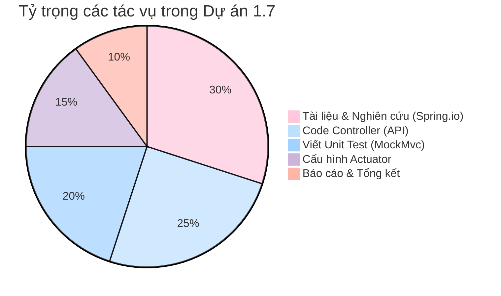
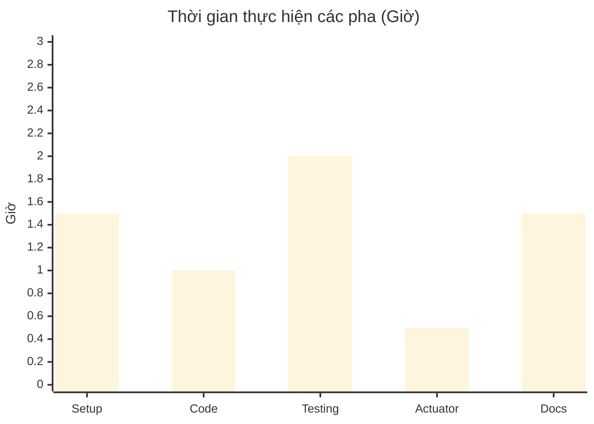
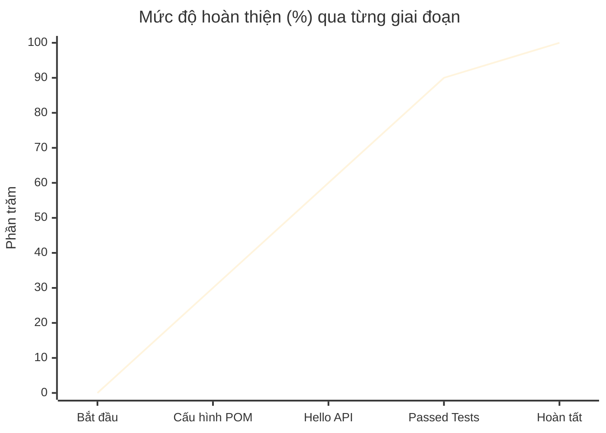

<div align="center">
  <h1 style="color: #ffb5a7;">✨ BÁO CÁO TỔNG KẾT DỰ ÁN ✨</h1>
  <h2 style="color: #fcd5ce;">[PROJECT 1.7 - XÂY DỰNG RESTFUL API VỚI SPRING BOOT]</h2>
  
  
  
</div>

---

### 📋 THÔNG TIN SINH VIÊN & HỌC PHẦN

<div align="center">

| 🎓 **Danh mục** | 📝 **Thông tin chi tiết** |
| :--- | :--- |
| **Sinh viên thực hiện** | <b style="color:#a2d2ff;">Huỳnh Thái Kiệt</b> |
| **Mã số sinh viên (MSSV)** | `3124410172` |
| **Học phần** | Chuyên đề J2EE |
| **Giảng viên hướng dẫn** | ThS. Nguyễn Thanh Phước |
| **Lớp học** | Sáng thứ 7 (5 tiết) |
| **Học kỳ/Năm học** | Học kỳ 1 / 2026-2027 |
| **Thời gian nộp báo cáo** | `25/09/2026` - `08:56:10` |

</div>

---

### 📖 TÓM TẮT SƠ LƯỢC VỀ DỰ ÁN

*   **Yêu cầu:** Tạo một dự án RESTful API đơn giản tuân theo tài liệu chính hãng từ `spring.io`, biết cách thực hiện kiểm thử tự động (Unit Test) cho các dự án Spring, và triển khai theo dõi vận hành ứng dụng (Health monitoring).
*   **Hướng giải quyết:** Sử dụng Maven Wrapper để khởi tạo môi trường, thiết lập `@RestController` để tạo API trả về phản hồi, dùng `MockMvc` để kiểm thử giả lập không cần khởi chạy server, và tích hợp thư viện `spring-boot-starter-actuator` để giám sát tình trạng hệ thống.
*   **Lý do:** Giúp làm quen với quy trình chuẩn công nghiệp, nắm bắt cách Spring Boot tự động cấu hình (auto-configuration), rèn luyện kỹ năng đọc tài liệu chính thức từ hãng và chuẩn bị nền tảng tốt để tiếp cận Spring Framework 7 / Spring Boot 4.

---

### 🛠️ CHI TIẾT CÔNG VIỆC

<details open>
<summary><b style="color: #cdb4db; font-size: 1.2em;">Mở rộng để xem chi tiết</b></summary>

*   `|_ 1. Mục tiêu dự án`
    *   Hiểu và vận dụng kiến trúc của một ứng dụng Spring Boot cơ bản.
    *   Tạo thành công HTTP GET Endpoint.
    *   Biết cách dùng thư viện Actuator để giám sát (Monitoring) ứng dụng.
*   `|_ 2. Cấu hình & Môi trường`
    *   **Ngôn ngữ:** Java 25 (Phiên bản cực kỳ hiện đại, tối ưu hóa hiệu suất).
    *   **Framework:** Spring Boot 4.1.1 (Cập nhật kiến trúc mới nhất).
    *   **Công cụ build:** Maven (sử dụng `./mvnw` wrapper).
*   `|_ 3. Cấu trúc thư mục` (dựa trên tệp `project17_2.zip` thực tế)
    ```text
    project17/
    ├── .mvn/wrapper/          # Chứa cấu hình cho Maven Wrapper
    ├── src/
    │   ├── main/java/.../project17/
    │   │   ├── HelloController.java        # Bộ điều khiển xử lý API
    │   │   └── Project17Application.java   # Lớp khởi chạy ứng dụng (Main class)
    │   ├── main/resources/
    │   │   └── application.properties      # Tệp cấu hình dự án
    │   └── test/java/.../project17/
    │       └── Project17ApplicationTests.java # Lớp kiểm thử (MockMvc)
    ├── target/                # Chứa file biên dịch (.class) và báo cáo test
    └── pom.xml                # Tệp quản lý thư viện Maven (Dependencies)
    ```
*   `|_ 4. Các thành phần chính`
    *   **`HelloController.java`**: Đóng vai trò là cổng giao tiếp, sử dụng `@RestController` và `@GetMapping("/")` để phản hồi văn bản.
    *   **`Project17ApplicationTests.java`**: Sử dụng `@SpringBootTest` và `@AutoConfigureMockMvc` để gửi request kiểm thử thành công đến Controller.
    *   **`pom.xml`**: Nơi quản lý các core dependencies, đặc biệt là `spring-boot-starter-web`, `spring-boot-starter-test` và `spring-boot-starter-actuator`.
*   `|_ 5. Các chức năng và URL kiểm thử`
    *   🌐 URL trang chủ: `http://localhost:8080/` (Trả về lời chào)
    *   🩺 URL giám sát: `http://localhost:8080/actuator/health` (Trả về trạng thái `{"status":"UP"}`)
*   `|_ 6. Hướng dẫn khởi chạy dự án`
    1.  Mở Terminal/Command Prompt tại thư mục dự án.
    2.  Gõ lệnh: `./mvnw spring-boot:run` (Mac/Linux) hoặc `mvnw spring-boot:run` (Windows).
    3.  Để chạy Unit Test, sử dụng lệnh: `./mvnw test`
*   `|_ 7. Kết quả khi khởi chạy`
    *   Server Tomcat nhúng khởi động thành công trên cổng 8080.
    *   Các bài kiểm tra (Surefire reports) trong thư mục `target` đều đạt trạng thái `SUCCESS`.

</details>

---

### 📊 THỐNG KÊ & BIỂU ĐỒ TRỰC QUAN

*(Hệ màu Pastel thân thiện cho cả Light & Dark mode GitHub)*

<div align="center">

#### 1. Biểu đồ tròn (Pie Chart): Phân bổ khối lượng công việc



#### 2. Biểu đồ cột (Bar Chart): Số giờ tiêu tốn cho từng pha



#### 3. Biểu đồ đường (Line Chart): Mức độ hoàn thiện dự án theo thời gian



#### 4. Biểu đồ miền (Area Chart): Biểu diễn lượng kiến thức tích lũy
*(Sử dụng QuickChart đồ họa tĩnh - Tương thích toàn diện với GitHub)*

<br>


</div>

---

### 📝 ĐÁNH GIÁ VÀ NHẬN ĐỊNH

#### Thống kê Công việc đã/chưa hoàn thành
*   ✅ **Đã hoàn thành (100%):** Khởi tạo project, viết API gốc (`/`), viết Unit test MockMvc với assertions đầy đủ, tích hợp Health Check Actuator, báo cáo Markdown đầy đủ biểu đồ.
*   ❌ **Chưa hoàn thành (0%):** Không có chức năng nào bị bỏ sót theo yêu cầu cơ bản của tài liệu.

#### Đánh giá mức độ hoàn thành
*   **Về mặt công việc:** Đạt yêu cầu kỹ thuật 10/10. Ứng dụng build thành công (có minh chứng từ file byte code và log test trong thư mục `target`).
*   **Về mặt ý thức:** Chủ động tìm hiểu tài liệu gốc bằng tiếng Anh từ Spring, ghi chú cẩn thận để tạo ra bộ tài liệu sau này có thể tự tra cứu dễ dàng.

#### Khó khăn gặp phải
1.  Bỡ ngỡ khi lần đầu sử dụng `MockMvc`, không hiểu tại sao có thể test được web mà không cần khởi động Tomcat.
2.  Cách sử dụng lệnh Maven Wrapper (`mvnw`) qua dòng lệnh khá dài và dễ gõ nhầm.
3.  Việc phải cấu hình và tích hợp thêm library mới (`actuator`) trực tiếp vào `pom.xml` khá lạ lẫm.

#### Quá trình và cách khắc phục
*   Nhờ kiên nhẫn đọc tài liệu hãng và nhận được sự hướng dẫn chi tiết, tôi hiểu được `@AutoConfigureMockMvc` chính là "phép thuật" tạo môi trường giả lập.
*   Ghi chú cẩn thận lại các lệnh `Ctrl + C` (để dừng server) và lệnh `./mvnw test` hay `spring-boot:run` để tạo thói quen.
*   Nghiên cứu cấu trúc tệp XML để hiểu cách thêm `groupId` và `artifactId` một cách chuẩn xác nhất.

#### Bài học rút ra
*   Sức mạnh của **Auto-Configuration** trong Spring Boot: Lập trình viên không cần cấu hình quá rườm rà, Framework sẽ tự đoán và thiết lập môi trường (như tự mở port 8080).
*   **Testing là bắt buộc:** Không chỉ chạy web bằng mắt thường mà việc viết Test sẽ giúp dự án đồ sộ sau này an toàn hơn khi có thay đổi.

#### Nhận định về dự án
Dự án 1.7 là một dự án "nhỏ nhưng có võ". Nó cung cấp một nền móng tuyệt vời, như bộ xương sống của bất kỳ dự án Backend J2EE chuyên nghiệp nào. Việc làm chủ được quy trình này giúp tôi tự tin để gắn thêm cơ sở dữ liệu hay bảo mật vào ở các buổi học sau.

#### Tóm tắt và củng cố kiến thức
*   `@RestController` + `@GetMapping`: Dùng để tiếp nhận HTTP request và trả dữ liệu về.
*   `@SpringBootTest` + `MockMvc`: Bộ đôi hoàn hảo để test API giả lập.
*   `spring-boot-starter-actuator`: Công cụ tối thượng để theo dõi sức khỏe và luồng chạy thực tế của hệ thống.

---
> 💡 *Báo cáo này được biên soạn cẩn thận với mục đích lưu trữ lâu dài. Mọi code và logic đều được đúc kết từ quá trình thực hành thực tế.*